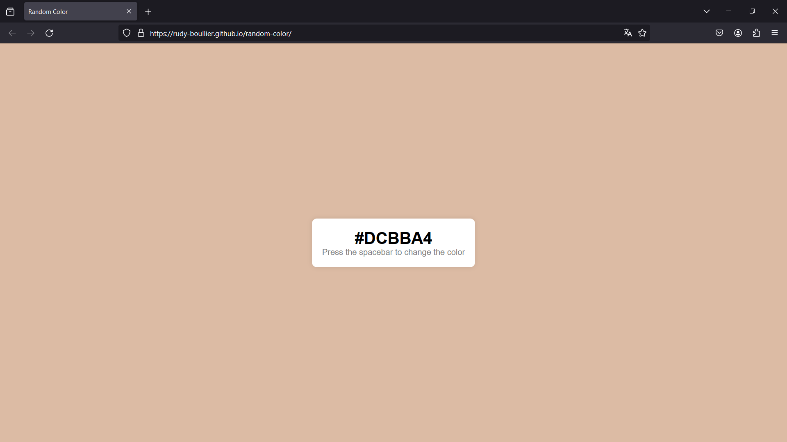

# random-color

  
  
  

Ce projet est un générateur de couleurs aléatoires créé en HTML, CSS et JavaScript. L'application permet à l'utilisateur de générer des couleurs aléatoires en appuyant sur la barre d'espace ou en rechargeant la page. La couleur générée est affichée à l'écran avec son code hexadécimal. Ce générateur de couleurs aléatoires peut être utilisé pour diverses applications telles que la conception de sites Web, la création d'œuvres artistiques numériques, ou simplement pour s'amuser à explorer différentes combinaisons de couleurs.

Fonctionnalités :

- Génération de couleurs aléatoires en appuyant sur la barre d'espace ou en rechargeant la page.
- Affichage du code hexadécimal de la couleur générée.
- Interface simple et intuitive.

## Preview

  

## Author

- Rudy Boullier
